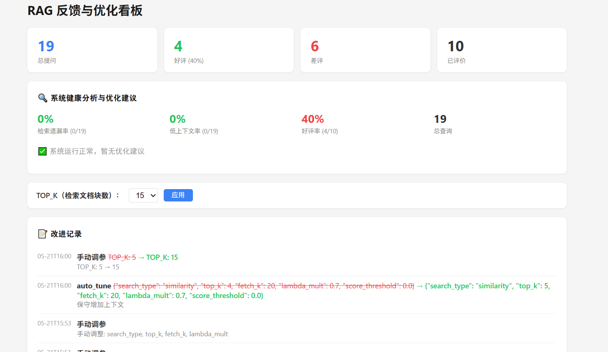
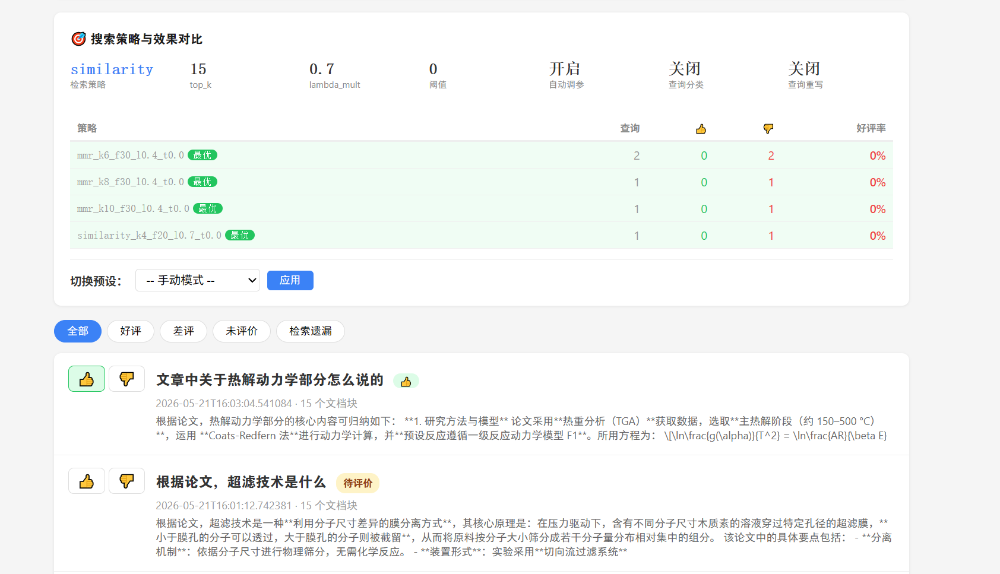

# rag-kb

[](https://github.com/khusdasz-cmd/rag-kb/actions/workflows/ci.yml)

**本地知识库问答系统** — 下载即用，支持 Ollama / LM Studio / OpenAI 多后端，配合 Chatbox 使用。
内置用户反馈闭环与自适应搜索策略，越用越好。

## 功能

- **RAG 检索增强生成**：将 PDF 导入向量数据库，提问时自动检索相关内容，让 LLM 基于你的文档回答
- **多后端切换**：一个 `.env` 文件切换 Ollama、LM Studio、OpenAI 等任意 OpenAI 兼容 API
- **用户反馈系统**：Web 看板支持 👍/👎 评价，自动归类差原因，数据驱动持续优化
- **自适应搜索策略**：4 种检索策略（相似度/MMR/分数阈值/L2 距离）+ LLM 查询重写，系统根据反馈自动调参
- **系统健康看板**：实时展示检索质量、好评率趋势、优化建议、各策略效果对比
- **纯离线可选**：搭配 Ollama 可实现完全本地运行，数据不出本机
- **Chatbox 兼容**：零配置 UI，设好 API 地址即可使用

## 快速开始

```bash
# 下载
git clone https://github.com/khusdasz-cmd/rag-kb.git
cd rag-kb

# 安装依赖
pip install -e .

# 编辑配置（首次运行会自动从 .env.example 生成）
# 按需修改 LLM_TYPE、API Key、模型名等
vi .env

# 把 PDF 丢进 docs/ 目录，导入向量库
python ingest.py

# 启动
python rag_proxy.py
```

然后打开 Chatbox → 设置 → AI 模型提供商 → **OpenAI API Compatible**

| 字段 | 值 |
|---|---|
| API Key | 任意（如 `sk-rag`） |
| API 地址 | `http://localhost:9124/v1` |
| 模型 | 按后端填写 |

**无需手动创建任何文件夹。** `.env` 首次自动生成，`docs/` 自动创建，`chroma_db/` 导入时自动生成。

## 反馈看板

启动后在浏览器打开 `http://localhost:9124/feedback`



系统健康分析面板展示：检索遗漏率、低上下文率、好评率，并自动生成优化建议。



搜索策略面板展示：当前策略参数、预设快捷切换、各策略效果对比表（最优标 best）。

### 反馈闭环

```
Chatbox 提问 → 检索 → LLM 回答
                    ↓
           打开看板点 👍/👎
                    ↓
          自动归类原因 → 自动调参
                    ↓
           刷新看板查看效果对比
```

## 自适应搜索策略

| 策略 | 适用场景 |
|------|---------|
| `similarity` | 精确匹配，默认 |
| `mmr` | 综述类问题，平衡相关性与多样性 |
| `similarity_score_threshold` | 精确定位，只取高相关结果 |
| `similarity_with_score` | 调试/分析，带距离分数 |

### 自动调参规则

收到 👎 时根据分类自动调整：

| 差评分类 | 自动行为 |
|---------|---------|
| `retrieval_miss` | top_k +2 或切到 MMR |
| `answer_wrong` | top_k +1 |
| `too_long` | top_k -1 |
| `not_helpful` | 增加多样性 |

带稳定性检查（最近 20 条中差评 ≥ 2 条才调），避免震荡。

### LLM 查询重写

启用后，用户提问会自动被 LLM 扩展为更匹配文档的搜索表达式，提升检索命中率。在看板策略面板一键开启。

## 配置

编辑 `.env` 文件切换后端：

### Ollama 模式（默认，完全本地）

```env
LLM_TYPE=ollama
OLLAMA_URL=http://localhost:11434
OLLAMA_MODEL=qwen2.5:7b
OLLAMA_EMBED_MODEL=bge-m3:567m
```

### LM Studio 模式

```env
LLM_TYPE=openai
OPENAI_URL=http://127.0.0.1:1234/v1
OPENAI_KEY=not-needed
OPENAI_MODEL=你的模型名
```

### OpenAI / 任意 API

```env
LLM_TYPE=openai
OPENAI_URL=https://api.openai.com/v1
OPENAI_KEY=sk-your-key
OPENAI_MODEL=gpt-4o-mini
```

## 项目结构

```
├── rag_kb/                 # 核心 Python 包
│   ├── rag_proxy.py        # RAG 代理服务（FastAPI）
│   ├── adaptive_searcher.py # 自适应搜索引擎（4种策略 + 查询重写 + 自动调参）
│   ├── ingest.py           # PDF 导入脚本
│   └── embedder.py         # Ollama embedding 客户端
├── ingest.py               # 入口（委托给 rag_kb.ingest）
├── rag_proxy.py            # 入口（委托给 rag_kb.rag_proxy）
├── feedback.html           # 反馈看板（单页 HTML）
├── .env                    # 配置文件（自动生成，已 gitignore）
├── .env.example            # 配置模板
├── pyproject.toml          # 项目元数据与依赖
├── LICENSE                 # MIT 许可证
├── screenshots/            # 功能展示截图
├── chroma_db/              # 向量数据库（导入时自动生成，已 gitignore）
└── docs/                   # 放 PDF 文件（自动创建，已 gitignore）
```

## 工作原理

```
Chatbox → RAG Proxy → ChromaDB 检索相关文档
                     → LLM 查询重写（可选）
                     → 自适应策略路由
                     → 注入上下文到 prompt
                     → 转发给 LLM 后端
                     → 返回带知识库内容的回答
                     → 用户反馈闭环（看板评价 → 自动调参）
```

- **LLM 后端可切换**：Ollama / LM Studio / OpenAI
- **Embedding 始终走本地 Ollama**：速度快、免费用、数据不出本机
- **自适应搜索**：根据用户反馈自动调整检索策略，越用越好

## API 端点

| 端点 | 说明 |
|------|------|
| `POST /v1/chat/completions` | OpenAI 兼容聊天接口 |
| `GET /v1/models` | 可用模型列表 |
| `GET /v1/config` | 查看运行时配置 |
| `POST /v1/config` | 修改运行时配置 |
| `GET /v1/strategy` | 查看搜索策略参数 |
| `POST /v1/strategy` | 切换搜索策略 |
| `GET /v1/strategy/stats` | 各策略效果统计 |
| `POST /v1/feedback` | 提交评价 |
| `GET /v1/feedback/summary` | 统计数据 |
| `GET /v1/feedback/insights` | 系统健康分析与建议 |
| `GET /v1/feedback/improvements` | 改进记录 |
| `GET /feedback` | 反馈看板 |

## 隐私

- `.env`、`feedback.db`、`docs/`（含 PDF）、`chroma_db/` 均在 `.gitignore` 中，不会提交
- API Key 只存在本地 `.env` 文件
